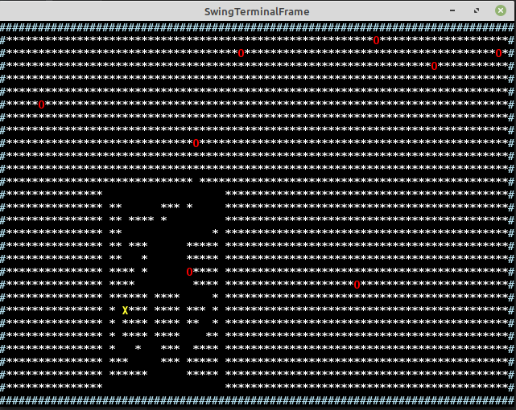

# *Supapac*
ldts-project-assignment-g0104 created by GitHub Classroom

This project is a fusion between Pacman and Supaplex.
The game has 2/3 levels, to complete each model.level the player, who controls Bob, must gather coins that are scattered
around the model.level, while doging gomps much like the ghosts from pacman.

## Made By
João Rodrigues (up201907863@fc.up.pt).
Carlota Silva (up201908057@fe.up.pt). 
Diogo Vieira (up201405188@fc.up.pt).
Laboratorio de Desenho e Teste de Algoritmos
Report *link*

## Implemented Features

### Movement
to move the player we have to use the arrow keys.

### Materials 
Are the items that the player has to collect in order to complete a model.level.

### Monsters
enemys that move in a certain pattern, taking 1 life if the player comes in contact with them.

### Lives
The player always starts with 3 lives.

### GameDisplay

## Planned Features
### Menus
An initial menu allowing the user the start or change levels, and quit the game.

### Restart
The player can restart the model.level by pressing a certain key.

### Gates
a block that lets the player pass in one direction while blocking him if he atempts in another direction, 
almost like a door that only opens from one side.

### supapac.elements.Portals
a block that will teleport the player if he comes in contact.

### Levels
Differents Levels increasing the model.level of difficulty by adding "objects" that did not exist in the previous levels.

## Design Patterns

### Singleton
The supapac.gui.Arena class is instanciated only once, which manages and processes all supapac.Game related elements and functions.

## Code Smells

### Large Class
The class supapac.gui.Arena has too many methods and can be refactored in order to obtain a better and more oriented code design.

### Shotgun Surgery
we had to make some methods public in order to make them accessible to the unit tests implemented. 
We intend to improve these and other parts of the code and design in the next week.

## UML Diagram

